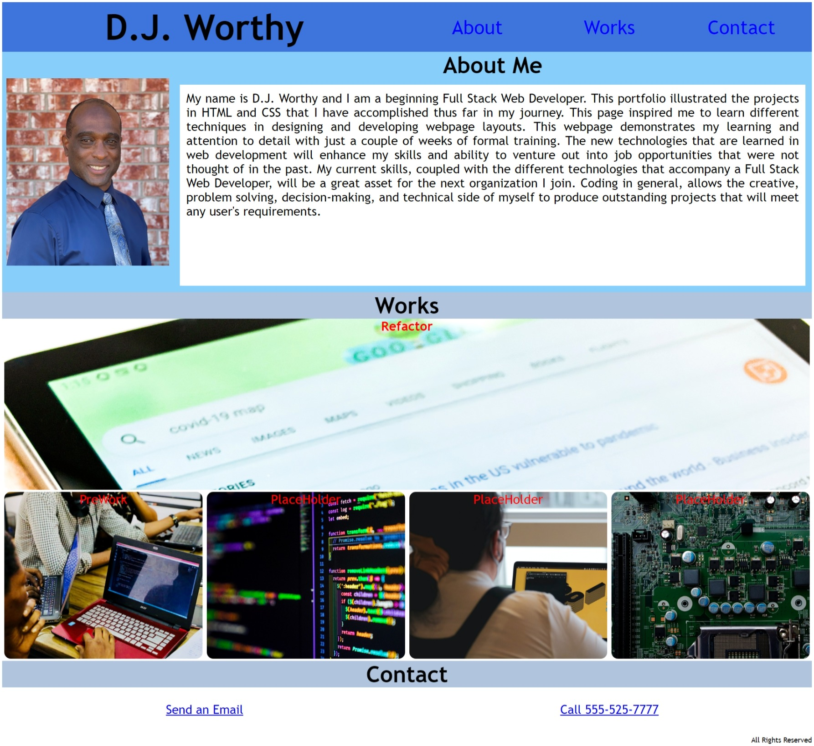
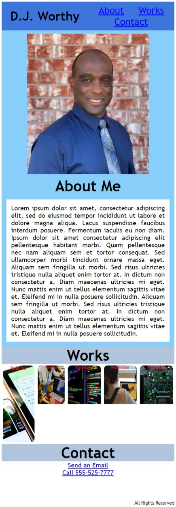

# Assignment 02:  Portfolio

## Description
This webpage is to illustrate the works and projects that have been completed by beginning Full Stack Web developer, D. J. Worthy.  The page contains links to various works and contact information.  The webpage was designed and developed with HTML and CSS.  There was also an extensive use of Flexbox and media queries to make the webpage responsive while viewing from devices with different sized screens. 

## Screenshot of webpage

## Webpage URL

[Portfolio_Webpage_Live](https://djavanw.github.io/djw_portfolio/)

## Contributor
D.J. Worthy

## License
The Unlicense

### Date
13 February 2021
