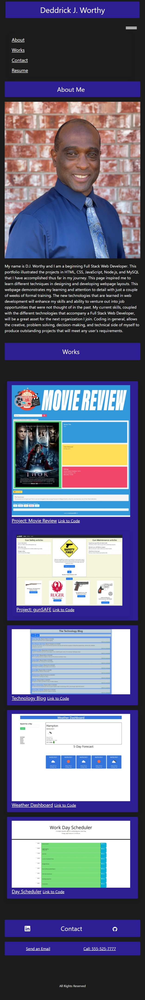

# Assignment 02, 08, & 16:  Professional Portfolio

## Description
This webpage is to illustrate the works and projects that have been completed by beginning Full Stack Web developer, D. J. Worthy.  The page contains links to various works and contact information.  The webpage was designed and developed with HTML, CSS, Bulma CSS Framework, Sass, and JavaScript.  There was also an extensive use of Flexbox to make the webpage responsive while viewing from devices with different sized screens. 

## Webpage URL

[Portfolio_Webpage_Live](https://djavanw.github.io/djw_updated_portfolio/)

## Screenshot of webpage

## Screenshot of webpage (mobile version)

## License
This project falls under the MIT License.  The full documentation for this license can be found at [MIT Full Documentation](https://choosealicense.com/licenses/mit).

  Below is an excerpt of the MIT License.
   
  Copyright <YEAR> <COPYRIGHT HOLDER>
    
    Permission is hereby granted, free of charge, to any person obtaining a copy of this software and associated documentation files (the "Software"), to deal in the Software without restriction, including without limitation the rights to use, copy, modify, merge, publish, distribute, sublicense, and/or sell copies of the Software, and to permit persons to whom the Software is furnished to do so, subject to the following conditions:
    The above copyright notice and this permission notice shall be included in all copies or substantial portions of the Software.
    THE SOFTWARE IS PROVIDED "AS IS", WITHOUT WARRANTY OF ANY KIND, EXPRESS OR IMPLIED, INCLUDING BUT NOT LIMITED TO THE WARRANTIES OF MERCHANTABILITY, FITNESS FOR A PARTICULAR PURPOSE AND NONINFRINGEMENT. IN NO EVENT SHALL THE AUTHORS OR COPYRIGHT HOLDERS BE LIABLE FOR ANY CLAIM, DAMAGES OR OTHER LIABILITY, WHETHER IN AN ACTION OF CONTRACT, TORT OR OTHERWISE, ARISING FROM, OUT OF OR IN CONNECTION WITH THE SOFTWARE OR THE USE OR OTHER DEALINGS IN THE SOFTWARE.

## Contributor:
The contributor for this project is:  D. Javan Worthy

If there are any questions, the contributor can be reached at emailfake@qmail.com.

### Date:
29 May 2021